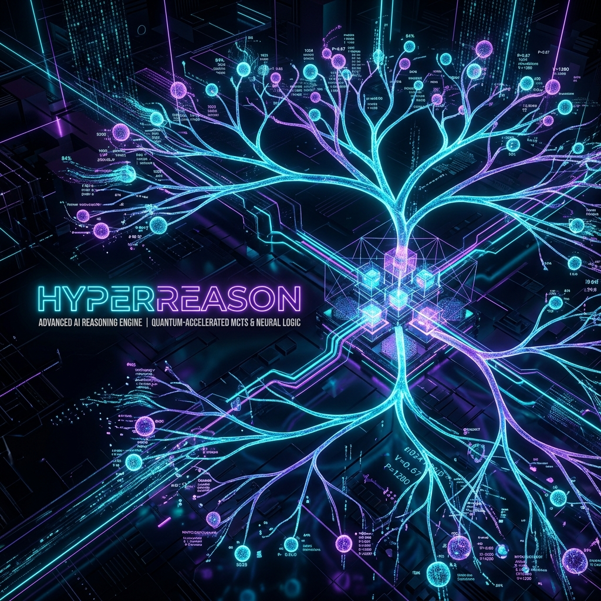

<div align="center">



# ⚡ HyperReason (`hypermcts`)

### An honest, multi-provider Adaptive-Entropy MCTS test-time compute engine for LLMs — that **actually runs** and reports when it loses.

[](https://github.com/rudra496/hyper-reason/actions/workflows/ci.yml)
[](https://pypi.org/project/hypermcts/)
[](https://rudra496.github.io/hyper-reason)
[](#)
[](LICENSE)

**[🌐 Live Web Demo](https://rudra496.github.io/hyper-reason)** · **[📊 Real Eval Traces (Raw JSONL)](eval/runs/)** · **[🧾 Honest Eval Contract](eval/CONFIG.md)**

</div>

> **v2.0.1 is a full honest rebuild.** v1.x shipped an engine that never called a model and an invented benchmark table. v2 genuinely drives real LLMs (Z.AI GLM, OpenAI, DeepSeek, Groq, Ollama, Transformers), and publishes transparent evaluations — including runs where MCTS underperformed greedy. No fake fallbacks, every number traceable to code.

---

## 🌟 Supported Model Providers

HyperReason supports **any** LLM provider or local runner out of the box:

| Provider | Class | Supported Models / Endpoints |
|---|---|---|
| **Z.AI / GLM** | `GLMBackend` | `glm-4.6`, `glm-4-flash`, `glm-4-plus` (Anthropic API Compatible) |
| **OpenAI / DeepSeek / Groq** | `OpenAIBackend` | `gpt-4o`, `gpt-4o-mini`, `deepseek-reasoner`, Groq, vLLM, LM Studio |
| **Ollama (Local)** | `OllamaBackend` | `llama3:8b`, `deepseek-r1:8b`, `qwen2.5:7b`, `mistral` |
| **HuggingFace (Local)** | `TransformersBackend` | PyTorch / HuggingFace AutoModel causal models |
| **Mock Engine (Offline)** | `MockBackend` | Deterministic heuristic sampler for instant testing without API keys |

---

## ⚡ Quickstart

### 1. Installation

```bash
pip install hypermcts
```

> **Note on Naming:** PyPI package name is **`hypermcts`** -> imports in Python as **`hyper_reason`**.

---

### 2. Python API Usage

```python
import os
from hyper_reason import wrap_model, GLMBackend, OpenAIBackend, OllamaBackend, MockBackend

# Option A: Z.AI / GLM Backend
os.environ["ANTHROPIC_BASE_URL"] = "https://api.z.ai/api/anthropic"
os.environ["ANTHROPIC_API_KEY"] = "your_key_here"
model = wrap_model(GLMBackend(model="glm-4.6"))

# Option B: OpenAI / DeepSeek / Groq Backend
# model = wrap_model(OpenAIBackend(model="gpt-4o-mini", api_key="sk-..."))

# Option C: Offline / Mock Backend (No API Key Required)
# model = wrap_model(MockBackend())

# Execute AE-MCTS Search
res = model.reason("Janet has 3 boxes of 12 apples, gives away 5 and eats 2. How many remain?")

print("Boxed Answer:", res["boxed_answer"])       # Consensus answer: \boxed{29}
print("Confidence  :", res["confidence"])         # Agreement fraction across terminal trajectories
print("Simulations:", res["metrics"]["simulations_executed"])
print("KV Savings  :", res["metrics"]["flashkv"]) # Projected KV-cache memory accounting
```

---

### 3. Command Line Interface (CLI)

```bash
# Run with Z.AI GLM backend
hyper-reason --problem "If a train travels 60mph for 3.5h, how far?" --backend glm --model glm-4.6

# Run with OpenAI / DeepSeek
hyper-reason --problem "Solve 17 * 24" --backend openai --model gpt-4o-mini --api-key "sk-..."

# Run with Local Ollama
hyper-reason --problem "Explain quantum superposition" --backend ollama --model llama3:8b

# Run offline mock test
hyper-reason --problem "What is 10 + 15?" --backend mock
```

---

### 4. Interactive Web Server & Multi-Provider Playground

HyperReason ships with a built-in, dark glassmorphism Web Playground:

```bash
# Start local playground server
python examples/web_server.py
```
Open **[http://127.0.0.1:8088](http://127.0.0.1:8088)** in your browser to:
- Switch between providers (Z.AI, OpenAI, Ollama, Transformers, Mock) in real-time.
- Configure search budget sliders (Simulations, Search Depth, K-Candidates per step).
- Inspect the interactive ASCII Reasoning Tree & execution metrics.

---

## 📊 Real Benchmark — GSM8K-mini (N=20, GLM-4.6)

| Method | Accuracy | Unparsable | Mean Tokens | Mean Latency |
|---|---:|---:|---:|---:|
| **Greedy (T=0, 1 sample)** | **95.0%** (19/20) | 0% | 185 | 3.5s |
| Self-Consistency (K=4) | 90.0% (18/20) | 0% | 750 | 11.7s |
| **AE-MCTS (sims=6, k=2, d≤3)** | 85.0% (17/20) | 0% | 669 | 14.2s |

**Honest Reading:** Strong frontier models (like GLM-4.6) are already near the accuracy ceiling on easy GSM8K problems, so a modest-budget search underperforms greedy here. Test-time search pays off on **harder problems, weaker base models, or larger search budgets**. We publish the raw JSONL traces, not a fake win. **Not a claim of SOTA.**

---

## 🏗 Architecture & Modules

```
hyper_reason/
├── backends/        GLMBackend, OpenAIBackend, OllamaBackend, TransformersBackend, MockBackend
├── engine/          mcts (AE-MCTS), entropy, verifier (self-consistency), flashkv (projected)
├── orchestrator/    LangGraph proposer → verifier → refiner workflow with human-in-the-loop
├── wrapper.py       wrap_model() — 1-line model wrapper API
├── cli.py           CLI entrypoint (`hyper-reason`)
eval/                gsm8k_mini.py (reproducible eval) + aggregate.py + CONFIG.md
examples/            web_server.py (glassmorphism GUI) + demo_reasoning.py + benchmark_gsm8k.py
docs/                interactive browser site (pure JS engine port)
```

---

## 👨‍💻 About the Author & Connect

Developed with ❤️ by **Rudra Sarker** — Software Engineer & Industrial Engineering researcher.

- **🌐 Portfolio & Website:** [rudra496.github.io/site](https://rudra496.github.io/site)
- **🐙 GitHub:** [@rudra496](https://github.com/rudra496)
- **💼 LinkedIn:** [linkedin.com/in/rudrasarker](https://linkedin.com/in/rudrasarker)
- **🐦 X / Twitter:** [@Rudra496](https://x.com/Rudra496)
- **🚀 DevPost:** [devpost.com/rudrasarker](https://devpost.com/rudrasarker)
- **🔬 ResearchGate:** [Rudra-Sarker-3](https://www.researchgate.net/profile/Rudra-Sarker-3)
- **🆔 ORCID:** [0009-0001-4545-0932](https://orcid.org/0009-0001-4545-0932)
- **📘 Facebook:** [facebook.com/rudrasarker130](https://facebook.com/rudrasarker130)

---

## 📜 Citation

```bibtex
@software{sarker2026hyperreason,
  author = {Rudra Sarker},
  title  = {HyperReason: an honest Adaptive-Entropy MCTS test-time-compute engine for LLMs},
  url    = {https://github.com/rudra496/hyper-reason},
  year   = {2026}
}
```

MIT Licensed · Built by [Rudra Sarker](https://github.com/rudra496).
